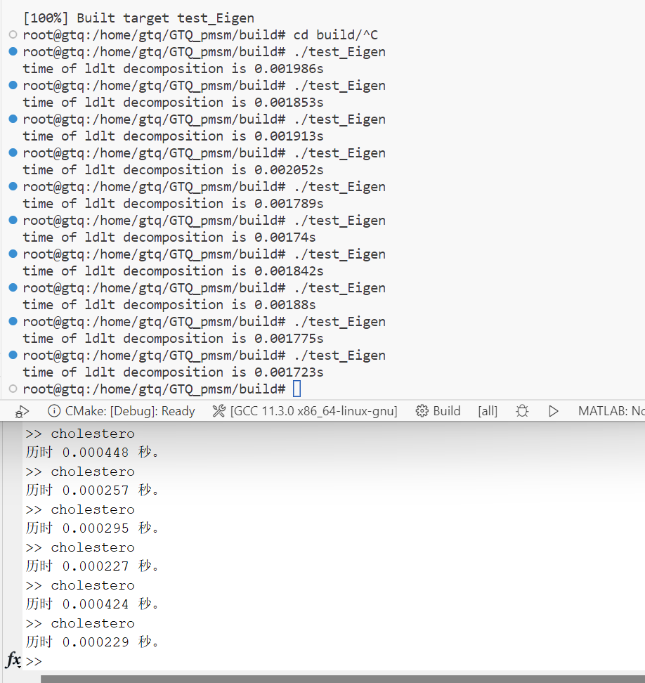
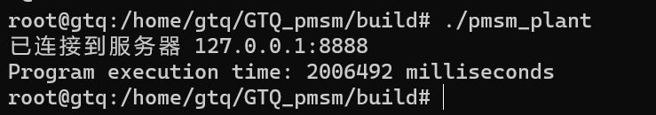

# GTQ_pmsm
使用C++的PMSM仿真

预计目标：
1. 完成单步FCS-MPC控制；
2. 加入延迟补偿
3. 加入通讯协议，完成半实物仿真
4. 加入SDA算法
5. 加入速度观测器
6. 将逆变器模型更换了中点型钳位三电平逆变器，PWM的仿真支持
7. ....

---

好久没有来写了，之前一直在忙着写小论文，没有弄c++的代码，现在为了往后退进度，先暂时不写SDA那一块的内容，来把之后
的短时域的方法写完完成。

上一次应该就是写到了SDA可以得到一个结果，但是还没有把结果放入到仿真当中检查具体的结果。

2023/06/23 潘继良

---

现在开始使用Eigen库之后，遇到了怎么和之前的lambda表达式兼容的问题，之前的是分开写直接传参，现在的话需要
可以使用这个矩阵直接相乘的方式来快速计算，因此还是打算对于坐标变换的话，提供lambda表达式和std::function
的两种接口，可以按照自己的需求选用。当前的使用情况：
1.  SDA算法中预测大矩阵的推导使用Eigen库+std::function。
2.  对于之间的单步简单的一次变换就直接使用内置数据类型和lambda表达式。

对于SDA算法的开发版本为了[test_Eigen3](./example/test_Eigen3.cpp)中，这里有着每一步的过程，之后会在稍微修改后，将这个结果作为一个友元类提高给MPCC控制器进行计算操作。

2023/06/02

---

开始进行SDA算法的测试，打算对Cholesky分解进行测试，如何可行进而继续之后的开发！

测试文件： 

基础功能：[test_Eigen](./example/test_Eigen.cpp)

chol分解：[test_Eigen](./example/test_Eigen2.cpp)

所用的时间的结果：

编译时增加了Eigen库的内容，会大大增加编译二进制文件的大小。通过连乘测试：[test_Eigen3](./example/test_Eigen3.cpp)

2023/05/29 潘继良

---

在完成SDA时，还是使用dq轴的数据，因为在类内部的状态变量也是使用的pmsm的数据。

完成TCP的通讯，主要的德debug时间在字节序的地方，因为使用了`vector<vector<int>>`的数据结构，所以在传递的时候就出现了问题，主要自己是怎么放的，怎么解析，这个过程自己要清楚。

使用图片的结果，需要使用33.44分钟。

TCP测试采用的是回环地址127.0.0.1，主要作用有两个：一是测试本机的网络配置，能PING通127.0.0.1说明本机的网卡和IP协议安装都没有问题；另一个作用是某些SERVER/CLIENT的应用程序在运行时需调用服务器上的资源，一般要指定SERVER的IP地址，但当该程序要在同一台机器上运行而没有别的SERVER时就可以把SERVER的资源装在本机，SERVER的IP地址设为127.0.0.1也同样可以运行。

这个地址也是给本机loop back接口所预留的IP地址，它是为了让上层应用联系本机用的，如果没有这个loop back接口通常上层应用无法与自己联系，因为它仍然会把数据往IP层发送，数据到了IP层如果发现目的地是自己，则回被回环驱动程序送回。因此通过这个地址也可以测试TCP/IP的安装是否成功，就是驱动，网卡 都是否正常，但无法测试出具体TCP/IP的配置是否正确，也无法测试出网卡是否正常，因为数据在离开IP层之前就已经被送回去了。

---

在MCU与PC通讯的时候需要把防火墙关闭。

---

在wsl2中使用串口与控制器（单片机）通讯

教程：https://learn.microsoft.com/zh-cn/windows/wsl/connect-usb

1. 首先需要在Windows下安装USBIPD-WIN，在Linux 中安装 USBIP 工具和硬件数据库。
2. 在管理员模式的powershell下`usbipd wsl list `查看现在和Windows连接的串口设备
3. 输入`usbipd wsl attach --busid <busid>`来将设备切换到wsl2中。
4. 就可以在wsl2中输入lsusb查看usb设备了。（你应会看到刚刚附加的设备，并且能够使用常规 Linux 工具与之交互。 根据你的应用程序，你可能需要配置 udev 规则以允许非根用户访问设备。）

使用`#include <boost/asio.hpp>`进行串口通讯

2023/05/23 潘继良

---

现在还在弄第一部分

这个仿真之前用于matlab中已经成功运行，因为使用了syms工具箱和为了之后在实物平台可以的测试，使用C++重新写，同时复习、实践c++中的知识点。

2023/05/18 潘继良

