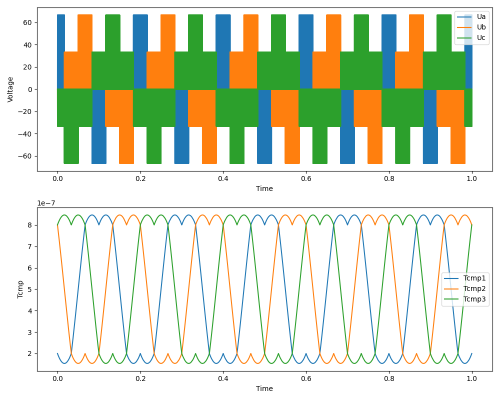
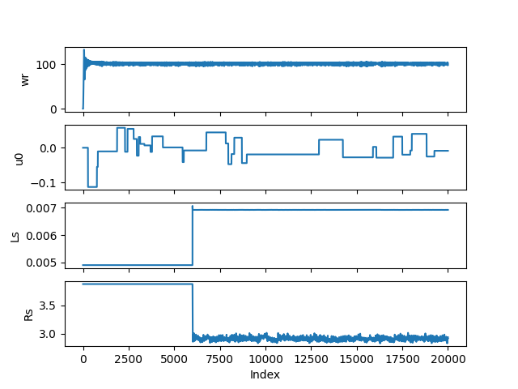
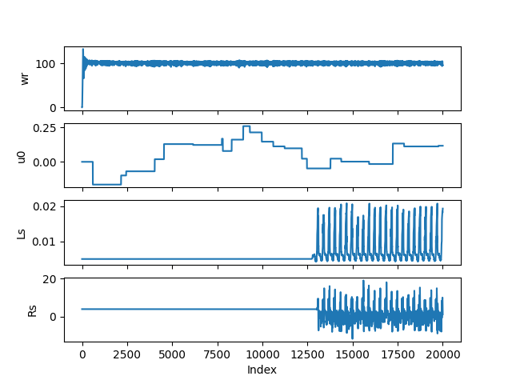
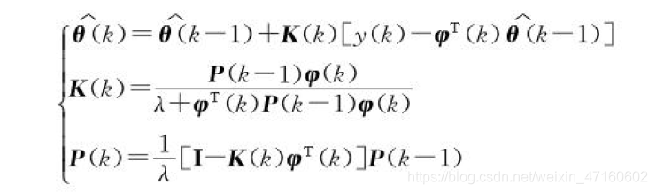
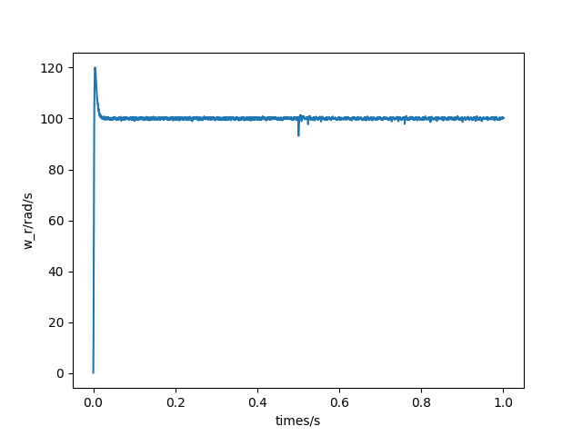
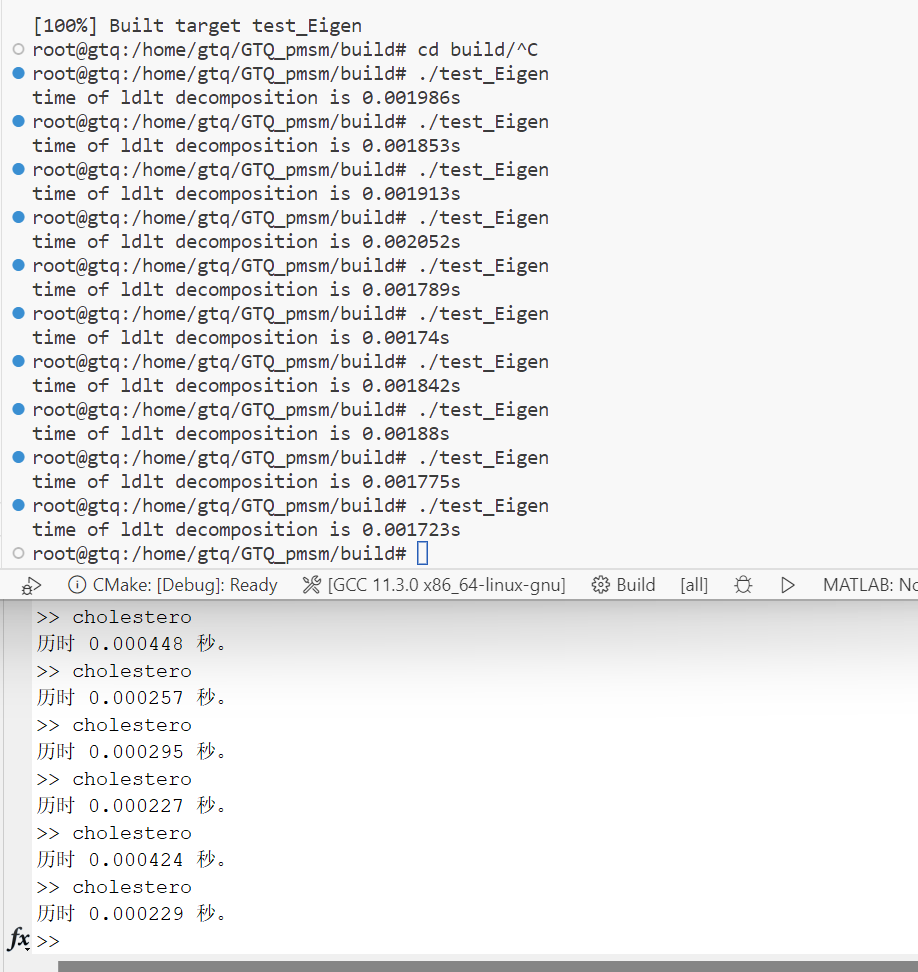
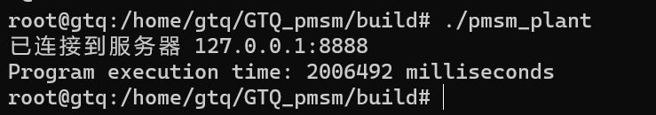

# GTQ_pmsm
使用C++的PMSM仿真，主要的控制为finite control set-model predictive control

预计目标：
1. 完成单步FCS-MPC控制；对应`DelayCompensation`分支
2. 加入延迟补偿 延迟补偿暂时没有写
3. 加入通讯协议，完成半实物仿真：对应`echo_and_nodelay`分支
4. 加入SDA算法；    对应`SDA_algorithm`分支
5. 加入速度观测器
6. 将逆变器模型更换了中点型钳位三电平逆变器，PWM的仿真支持
7. matlab中完成了单矢量、双矢量、无拍差，先完成扰动补偿和参数估计再决定；      无拍差对应`deadbeat`分支
8. ....

---

每头文件类的作用：
前向头文件`PMSM_sim.h`：包含整个框架的各个类、提供系统参数的定义和坐标变换。  
`commincation.h`：TCP连接类，定义client/server两个类，创建时为对象注册回调函数，在accept消息时可以自动调用注册的函数，具体的使用方法可以见[pmsm_plant](example/pmsm_plant.cpp)和[pmsm_controller](example/pmsm_controller.cpp)。  
`Compensator.h`：延迟补偿类，还没有完成。  
`current_controller.h`电流环控制器。现在已经提供的控制方案：单矢量控制、球型译码器控制(sphere decoding algorithm)、无拍差控制，可以参考[line68](example/parameter_identification_IRLS.cc)设置控制策略。  
`identifer.h`：用于封装各个观测器的接口类，用于继承具体的辨识方法，现在完成的参数观测辨识的方法有：最小二乘法辨识。  
`inverter.h`:逆变器对象。用于设置逆变器对象，输入开关序列，输出电压。  
`IRLS.h`：最小二乘法辨识的具体实现类。  
`PMSM.h`：永磁同步电机类。实现电机内部的状态和更新方程。
`sda.h`：球型译码器控制算法的实现，使用Eigen第三方库。成为`current_controller`电流控制器类的一个成员变量，直接提供算法优化。  
`speed_controller.h`：速度环控制器，内部是一个PID控制器。  
`svpmw.h`：调制类，未完成...  
`system.h`：被控对象类。实现PMSM和逆变器的继承，成为一个统一的被控对象，实现两个父类的一起更新。  

---

2023/08/17  
计算加入调制类，首先加入SVPWM的调制类，具体实现的过程之后再说，用于和对于FCS-MPC作为对比  
2023/08/80  
svpwm_test的马鞍波测试  
  
有关具有调制环节的测试就这样，对应具体的控制的之后有空再写，输入就是Valpha、Vbeta。回去看看反步法应该怎么弄。  

---

2023/08/29，潘继良  
找到问题bug，在2s/3s变换的时候把alpha beta -> a的坐标变换弄错了。。。  
更新之后的结果：   

---

最小二乘辨识的结果：Ls = 7e-3; Rs= 2.98;  
参数的问题吗？同样的结果在matlab中是没有问题的。  
  
matlab中的结果  
  
暂时留坑，先写反步法了，为了毕业打算。

---

2023/08/11
增加电流环控制器类中更新的一个接口  
从`std::vector<std::vector<int>> FCSMPCer::controller(const double &Id_ref, const double &Iq_ref, const double &theta_ele,
                                        const std::vector<double> &Iabc, const double &wr, const double& times,
                                         const double& u0_input)`  
   更改了：  
   `std::vector<std::vector<int>> FCSMPCer::controller(const double &Id_ref, const double &Iq_ref, const double &theta_ele,
                                        const std::vector<double> &Iabc, const double &wr, const double& times,
                                         const double& u0_input, vector<int>&)`  

sda使用包含的class，所有直接更新了控制器参数，其他的控制方法需要使用set来更新，有一个问题就是sda必须使用更新了，没有办法使用更新前的参数。

IRLS的辨识参数对于辨识的影响很大！！

---
2023/08/01
想要说明参数不准确的时候应该怎么办？
在使用SDA控制策略的方法中，因为`class sda`是被包括在了`class plant`中，最终决定加入extern变量作为控制的变量

2023/08/05
这个循环依赖的问题，在设计参数观测器时再一次遇到，这一次仅仅是一个简单的坐标变化问题，所以解决方案就不使用把之前的解决方案了，而是在用户定义的地方把坐标变换加入了。

使用这个方案的优势：
简单，但是代码复杂了  
不过这样也好。可不可以再把这个东西做一个更加独立的头文件出来呢？
但是显得整个class就会越来越复杂  add 

---

2023/07/26
创建新的分支deadbeat，并验证在原来的控制方案中可以实现同样的效果  
选择控制方案可以使用在电流控制器类中的set_control_method函数定义：

1. 单矢量控制方案(默认)
2. 使用球型译码算法
3. 使用无拍差的控制方案

---

2023/07/24
修复bug记录：
1. 反Clark变换中的系数问题
2. 龙格库塔法的简化修改
3. 中点电压映射的修改  
**这也意味着之前的分支是存在问题的代码，要使用之前先要完成bug的修补**

完成仿真。最终得到结果：在$t=0.5s$时加入阶跃扰动:

---

好久没有来写了，之前一直在忙着写小论文，没有弄c++的代码，现在为了往后退进度，先暂时不写SDA那一块的内容，来把之后
的短时域的方法写完完成。

上一次应该就是写到了SDA可以得到一个结果，但是还没有把结果放入到仿真当中检查具体的结果。

短时域FCS-MPC包括的内容
1. 无拍差电流FCS-MPC
2. 最优占空比模型预测电流控制
3. 

2023/06/23 潘继良

---

现在开始使用Eigen库之后，遇到了怎么和之前的lambda表达式兼容的问题，之前的是分开写直接传参，现在的话需要
可以使用这个矩阵直接相乘的方式来快速计算，因此还是打算对于坐标变换的话，提供lambda表达式和std::function
的两种接口，可以按照自己的需求选用。当前的使用情况：
1.  SDA算法中预测大矩阵的推导使用Eigen库+std::function。
2.  对于之间的单步简单的一次变换就直接使用内置数据类型和lambda表达式。

对于SDA算法的开发版本为了[test_Eigen3](./example/test_Eigen3.cpp)中，这里有着每一步的过程，之后会在稍微修改后，将这个结果作为一个友元类提高给MPCC控制器进行计算操作。

2023/06/02

---

开始进行SDA算法的测试，打算对Cholesky分解进行测试，如何可行进而继续之后的开发！

测试文件： 

基础功能：[test_Eigen](./example/test_Eigen.cpp)

chol分解：[test_Eigen](./example/test_Eigen2.cpp)

所用的时间的结果：

编译时增加了Eigen库的内容，会大大增加编译二进制文件的大小。通过连乘测试：[test_Eigen3](./example/test_Eigen3.cpp)

2023/05/29 潘继良

---

在完成SDA时，还是使用dq轴的数据，因为在类内部的状态变量也是使用的pmsm的数据。

完成TCP的通讯，主要的德debug时间在字节序的地方，因为使用了`vector<vector<int>>`的数据结构，所以在传递的时候就出现了问题，主要自己是怎么放的，怎么解析，这个过程自己要清楚。

使用图片的结果，需要使用33.44分钟。

TCP测试采用的是回环地址127.0.0.1，主要作用有两个：一是测试本机的网络配置，能PING通127.0.0.1说明本机的网卡和IP协议安装都没有问题；另一个作用是某些SERVER/CLIENT的应用程序在运行时需调用服务器上的资源，一般要指定SERVER的IP地址，但当该程序要在同一台机器上运行而没有别的SERVER时就可以把SERVER的资源装在本机，SERVER的IP地址设为127.0.0.1也同样可以运行。

这个地址也是给本机loop back接口所预留的IP地址，它是为了让上层应用联系本机用的，如果没有这个loop back接口通常上层应用无法与自己联系，因为它仍然会把数据往IP层发送，数据到了IP层如果发现目的地是自己，则回被回环驱动程序送回。因此通过这个地址也可以测试TCP/IP的安装是否成功，就是驱动，网卡 都是否正常，但无法测试出具体TCP/IP的配置是否正确，也无法测试出网卡是否正常，因为数据在离开IP层之前就已经被送回去了。

---

在MCU与PC通讯的时候需要把防火墙关闭。

---

在wsl2中使用串口与控制器（单片机）通讯

教程：https://learn.microsoft.com/zh-cn/windows/wsl/connect-usb

1. 首先需要在Windows下安装USBIPD-WIN，在Linux 中安装 USBIP 工具和硬件数据库。
2. 在管理员模式的powershell下`usbipd wsl list `查看现在和Windows连接的串口设备
3. 输入`usbipd wsl attach --busid <busid>`来将设备切换到wsl2中。
4. 就可以在wsl2中输入lsusb查看usb设备了。（你应会看到刚刚附加的设备，并且能够使用常规 Linux 工具与之交互。 根据你的应用程序，你可能需要配置 udev 规则以允许非根用户访问设备。）

使用`#include <boost/asio.hpp>`进行串口通讯

2023/05/23 潘继良

---

现在还在弄第一部分

这个仿真之前用于matlab中已经成功运行，因为使用了syms工具箱和为了之后在实物平台可以的测试，使用C++重新写，同时复习、实践c++中的知识点。

2023/05/18 潘继良

